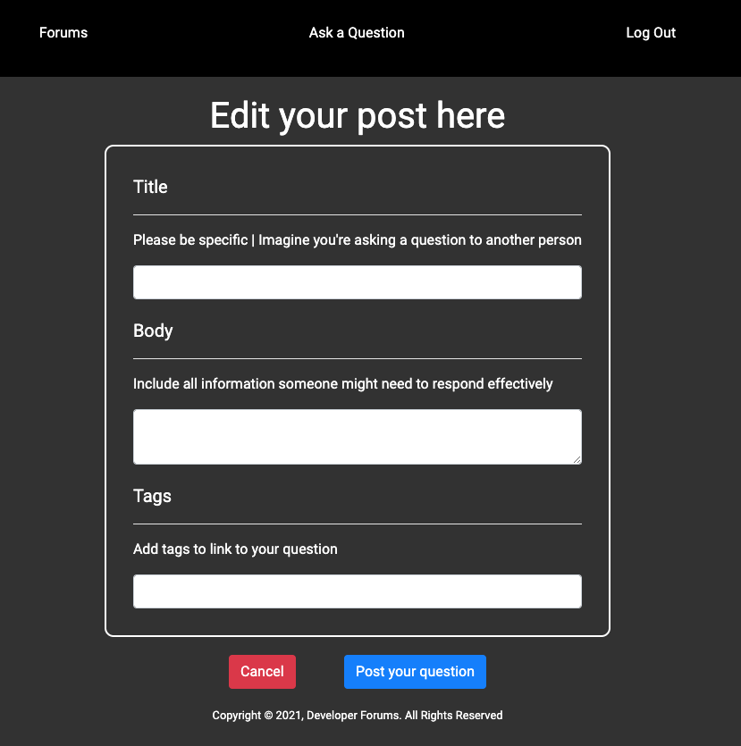

# 👨‍💻 Dev Forum 👩‍💻
Web forum designed for developers to come and ask questions about coding problems that they are having with other users having the ability to provide responses. 

---

## ⚙️ Technologies Used ⚙️

- HTML5
- CSS3
- JavaScript
- MongoDB
- Mongoose
- dotenv
- Express.js
- Node.js
- Heroku (for deployment)

---

## 📸 Screenshots of the Deployed App 📸

Log in screen where users can log in to the app

Error handling for invalid credentials

Sign up screen

Forum dashboard

Show view for forums

Ask a question!

Edit forum postings

Add a response and rating to the forum post

Edit a response

Delete a forum posting or response

--- 
## 💃 Access 🕺

You can access the deployed app [here](https://software-developer-forums.herokuapp.com/users/login). Get to posting!

---

## How to Use the App 

1. Sign up for an account using a password and unique username.
1. Log in to your account to access all forum postings. 
1. Click "Ask a Question" to generate a new forum posting for other developers to see. 
1. Click the title to any forum posting to see a show view of that post.
    - Alternatively, you can choose to delete a forum posting in this index view. 
1. Follow the prompts to edit the forum posting if desired.
1. Post responses and ratings on your forum posting or others!
1. Connect with other developers to get your most frustrating coding questions answered 👍
1. Log out and log back in whenever you would like.

--- 
## Future Enhancements 

- Ability to search by topic using a search bar
- Tags that search for like/similar tags when clicked
- Ability to click "up arrow" and "down arrow" favicons to increment or decrement a forum post's or response's 